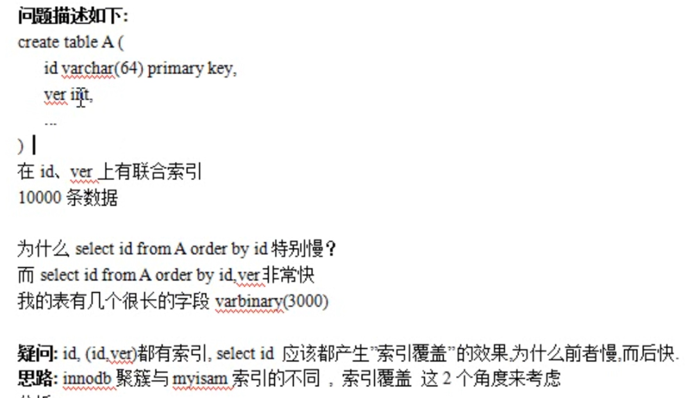
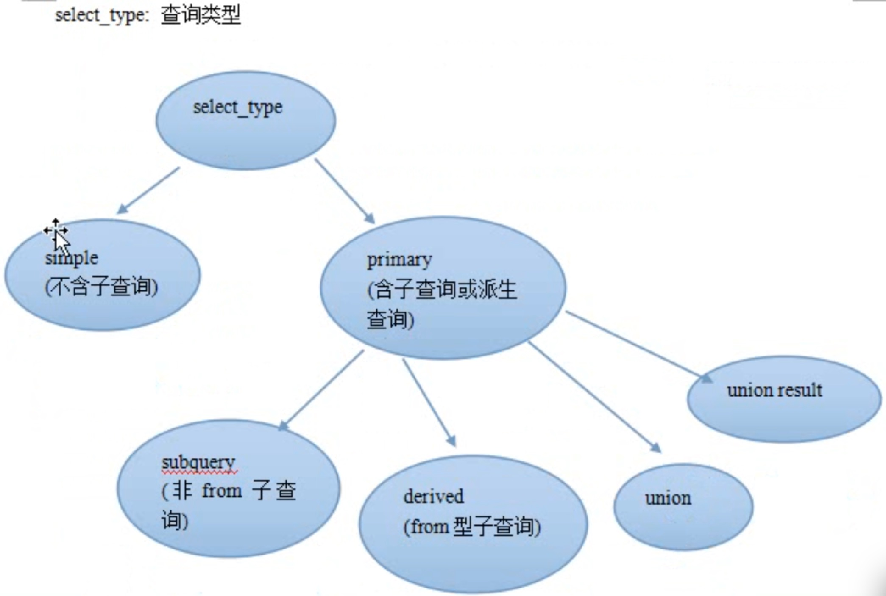

#### 表的优化

1. 定长与变长分离

如id  int 占 4个字节  char(4)也占 4个字节长度 也是定长   time 也是定长的  即每一单元占的字节是固定  

核心且常用字段 宜定义成定长的 放在一张表中  

而 varchar text blob 这种变长字段 适合单放一张表 用主键与核心表关联起来

2. 常用字段与不常用字段分离

3. 在1对多 需要关联统计的字段上添加冗余字段

		
		例如 A表有: 栏目id字段   B表有:id字段 帖子信息字段 栏目id字段    
		
		如果想统计出今天总共发贴数量 每个栏目下帖子数目 这时候需要A B 表联查
		
		假设A表有M条记录  B表有N条记录  瞬间在内存会产生 M * N记录 如果占用大量内存
		
		这时候不如在A表添加一个冗余字段 栏目数量字段  发一个帖子 就在所属栏目的 栏目数量字段 + 1
		
		

这是典型的空间换时间的思路

计算机优化主要是:  
	
	空间换时间   现在计算机 内存和硬盘越来越大 
	
	时间换空间 

#### 列的原则

1. 字段类型优先级

	整型  > date,time > enum,char > varchar  > blob,text
	

2. 列的特点分析

	整型  定长 没有国家 地区之分 没有字符集差异
	
	比如 tinyint 1,2,3 <-> char(1) a,b,c
	
	从空间上都是一个字节 但是order by排序 前者块
	
	原因: 后者需要考虑字符集和校对集 
	

	time  定长  运算块  节省空间   考虑时区的时候 写sql不方便 如 where > '2018-01-10'
	
	enum  能起到约束值得目的 内部用整型来存储 但与char联查时候 内部要经历串与值得变化
	
	char  定长 考虑字符集与校对集
	
	varchar 不定长  考虑字符集与校对集
	
	blob,text  无法使用内存临时表 排序只能在硬盘上进行
	
	
	关于 date/time的选择 明智意见是 直接选 int unsigned not null 存储时间戳
	
	https://www.xaprb.com/blog/2014/01/30/timestamps-in-mysql/
	
	性别: 以utf8为例
		
		char(1) 3个定长字节
		
		enum('男'， '女')  // 内部转成数字来存储 多了一个转换过程
		
		tinyint() // 0 1 // 定长一个1字节
	
3. 够用就行 如 smallint varchar(N)
	
	原因:
		
		大的字段浪费内存 影响速度
		
		例如年龄 用tinyint 最够了 255岁
		名字 char(20) 包括少数民族 也足够了  而汉族按照公安部规定最长是char(6)

4. 尽量避免用NULL()
	
	原因:
		
		NULL不利于索引 也不利于查询  要用特殊的字节来标注 
		
		在磁盘上占据空间更大 

5. Enum说明
		
		enum 在内部用整形来存储
		
		enum列 与 enum列 相关联速度最快
		
		enum列 比 varchar char 的弱势  在碰到与char关联时候 要转化 要花时间
		
		优势在于: 当char非常长时候 enum依然是整型固定长度  查询数据越大 enum优势越大
		
		enum列 与 varchar char关联 因为要转化 速度要比 enum > enum, char > char 要慢
	
#### 索引优化策略

1. 索引类型  
	
- B-tree索引   

		
		都用是平衡树 O(log2(N))
		
		NDB引起使用就是 T-tree
		
		myisam innod中默认使用 B-tree
		
		B-tree 可以理解为 排好序的快速查找结果
		
		对范围查询可以很好的优化
		
		

  
- hash索引
	
		
		在memory表里 默认是hash索引 hash理论查询时间复杂度为O(1)
		
		hash如此高效为何不用？
			
			hash计算后的结果是随机的  如果是在磁盘上放置数据  在磁盘的位置也是随机的
			
			无法对范围查询进行优化
			
			无法利用前缀索引  // name like 'li*'
			
			排序无法优化
			
			必须回行 就是说: 通过索引拿到数据位置 必须回到表中去数据
			
			
			
	

2. Btree索引常见误区
  
- 在where条件常用的列上都加上索引

		
		例 where cat_id=3 and price > 100; // 查询第3个栏目 100元以上的商品
		
		实际上 你可能在 cat_id 和 price 两个字段 都加上索引
		
		而实际上 上面where查询语句 只能用上 两个索引中的一个  因为是独立索引 同时只能用上1个索引
		
		解决办法: 联合索引 或者称为 多列索引
		

- 联合索引 多列索引
	
		
		联合索引 把 多个列看成一个整体的值 建立索引
		
		在多列上建立索引后 查询其中那个列 索引都将发挥作用
		
		注意: 多列索引上 索引发挥作用需要满足 左前缀要求  
			
			何为左前缀？ 建立索引过程 对于字段值是从左到有的过程  左边值是确定值不能通配符
				
				例如 列b like 'abc%' 这是可以的 abc是确定值  %是统配符 满足左前缀
				
				 列b like '%abc' 这是不可以的 左侧第一个值通配符 不满足左前缀
			
		在多列索引 where中的比较是 等于 是100%使用到索引 liKe > 只能部分使用索引
		
		某个多列索引中字段是否使用上索引 取决于 它们前面(这个前面以建立多列索引的位置比较)的全部100%使用了索引
		
		例如 index(a, b, c)
		
		where a =100  // a使用索引
		
		where a=100 and b=123  // a 和 b 都用了索引
		
		where a=100 and b=123 and c =12 // a 和 b c都用了索引
		
		where b=123  // b没有索引  以前 a没有使用索引
		
		where c=100   // c没有索引  因为c前面的a和b都没有使用索引
		
		where a=100  and c =12 // a使用索引 c没有用索引 因为c前面的b没有使用索引
		
		where a=100 and b>123 and c =12 // a使用索引 b使用索引 但不是100%使用 c没有用索引 因为c前面的b没有100%使用索引
		
		where a=100 and b like 'sql%' and c =12 // a使用索引 b使用索引 但不是100%使用 c没有用索引 因为c前面的b没有100%使用索引
		
		
				
		

##### 索引不仅可以提高查询速度 也可以提高排序速度  所以 order by 、group by  也会用到索引 
	
	index(c1, c2, c3, c4)  
	
	where c1 = x and c2 = x and c4> x and c3 = x  // c1 c2 c3 c4 都使用索引
	
	where c1 = x and c2 = x and c4= x order by c3 // c1 c2 c3 都使用索引  c4 没有使用索引 因为 c3不是100%使用
	 
	where c1 = x and c4= x group by c2, c3  // c1 使用索引  c2部分使用索引  所以c3 c4 没有使用
	
	where c1 = x and c4= x group by c3, c2  // c1 使用索引  所以c2 c3 c4 没有使用
	
	where c1 = x and c5= x group by c2, c3  // c1 c2 c3使用索引  所以 c5没有在多列索引字段中
	
	where c1 = x and c2= x and c5=x group by c2, c3  // c1 c2 c3使用索引
	

#### 聚簇 和 非聚簇
	
	hash索引 只能memory引擎中使用 因为内存不怕散列  而硬盘对于散列后性能太差了 所以不使用
	
	myisam innodb引擎在硬盘上 使用Btree 但是两者组织数据上 有区别 分为 聚簇 和 非聚簇
	
	myisam  索引指向行在磁盘上的位置
	
	innodb  直接在主键索引的树中 直接存储行的数据
	
	innodb的主索引文件上 直接存放该行数据 称为 聚簇索引  次索引指向对主键的引用
	
	myisam中主索引和次索引 都指向物理行---磁盘位置
	
	注意: 对于innodb来说
		
		主键索引:  既存储索引值 又存储行的数据
		
		次索引: 既存储索引值 又存储相对应的主键索引上引用
		
		如果没有主键 则会Unique key做主键
		
		如果没有Unique key 则系统生成一个内部的rowid做主键
		
		像innodb这种 主键的索引结构中 既存储了主键值 又存储了行数据 这种结构称之为 聚簇索引
		
	
	聚簇 与 非聚簇的区别:
		
		索引和数据是否在一起 在一起是聚簇 例如Innodb
	
	

#### 不规则主键的页分裂
	
	对于聚簇索引 如果主键索引所对应的列值是不规则 或者 说是不连续的 会造成 Btree的频繁修改  因而影响数据库的速度
	
	聚簇索引的页分裂
		
		聚簇结构的特点:
		
			根据主键查询条目时,不用回行(数据就在主键节点下)
			
			如果碰到不规则数据插入时,造成频繁的页分裂
	页分裂:
		
		创建聚集索引时，表格内的数据会按照索引的顺序存储在数据库的数据页面中
		
		当一个数据页达到了8K容量，如果此时发生插入或更新数据的操作，将导致页的分裂(又名页拆分)
		
		解决方法：设置适当的填充因子
		
	
	为什么会产生页分裂？
	
	这是因为聚簇索引采用的是平衡二叉树算法，而且每个节点都保存了该主键所对应行的数据
	
	假设插入数据的主键是自增长的，那么根据二叉树算法会很快的把该数据添加到某个节点下
	
	而其他的节点不用动；但是如果插入的是不规则的数据，那么每次插入都会改变二叉树之前的数据状态
	
	从而导致了页分裂
	
	总结:
		
		1. innodb的buffer_page很强大
		
		2. 聚簇索引的主键值 应尽量是连续增长的值 而不是随机值 不要用随机字符串或UUID 否则会造成大量的页分裂与页移动
			
		

#### 高性能索引策略
	
	1. 对于 innodb 而言 因为节点下有数据文件 因此节点的分裂将会比较慢
	
	2. 对于 innodb的主键  尽量用整形 而且是递增的整型
	
	3. 如果是无规律的数据 将会产生也的分裂 影响速度
	
	索引覆盖:
		
		是指 如果查询的列恰好是索引的一部分  那么查询只需要在索引文件上进行  不需要回行到磁盘再找数据
		
		这种查询速度非常快 称之为 索引覆盖
		
		
	

#### 性能分析题

			
	如果是 myisma引擎 速度不会有量级上的差异
	
	innodb表因为是聚簇索引 id索引要在磁盘上跨N多列  导致速度慢
	
	如果是 innnodb引擎 如果叶子比较轻 速度不会有量级上的差异  如果叶子重 速度差别很明显
	
	叶子轻重就看 单行记录的数据多否	
			
				

#### 索引长度与区分度

1. 理想索引
	
	- 查询频繁
	
	- 区分度高
	
	- 长度小
	
	- 尽量能覆盖常用查询的字段
	
	
2. 区分度
	
	100万用户  性别是 男、 女 各为50W 所以区分度低
	
3. 索引长度直接影响索引文件的大小  影响增删改查的速度 并间接影响查询速度 占用内存多

4. 针对列中的值 是从左往右截取部分 来建索引
	
	- 截取的越短 重复度越高  区分度越小  索引效果越不好
	
	- 截取越长   重复度越低  区分度越高  索引效果越好  但是带来的影响越大 增删改查变慢 并间接影响查询速度
	
5. 总结
	
	所以 我们要在 区分度 和  长度 两者上 取得一个平衡
	
	
	惯用手法是: 截取不同长度 并测试区分度
	
		
		select count(distinct left(word,6)) / count(*) from dict
		
		

6. 对于左前缀不易区分的列 建立索引技巧

- 例如对url字符串 把列内容倒过来 从有往左 建立索引

- 伪hash索引效果 同时存 url hash列  使用crc32()对列进行伪哈希  生成哈希值 

#### 多列索引的技巧

1. 多列索引的考虑因素: 列的查询频率 列的区分度 

#### 索引与排序

##### 排序可能发生2种情况:

1. 对于覆盖索引  直接在索引上查询时 就是有顺序的
	
		
		在Innodb引擎中沿着索引字段排序 也是自然有序的
		
		在myisam引擎即使按某索引排序 查询字段有非索引字段 
		例如 select id name from student where id =3
		对于这种情况 mysiam引擎的做法不是 索引->回行 而是 先取出所有行再排序
		
		

2. 先取出数据 形成临时表filesort 文件排序 但是文件可能在磁盘上 也可能在内存中

3. 我们争取的情况是 取出来的数据本身就是有序的 利用索引排序

#### 重复索引和冗余索引

1. 重复索引
	
		
		是指 在同1个列 或者 顺序相同的几个列 建立了多个索引 这就是没有意义的 浪费的索引
		
		解决办法:
			
			根据查询度 建立组合索引
			
			尽量产生覆盖索引
		
	

2. 冗余索引
	
		
		是指 2个索引所覆盖的列有重叠 但每个索引都能发挥不同的作用 称为 冗余索引
		

#### 索引碎片与维护

	
	在长期的数据更改过程中 索引文件和 数据文件 都将产生空洞 形成碎片
	
	我们可以通过一个nop(no-operation)操作不产生对数据实质影响的操作
	
	来修改表 比如 表的引擎是innodb 可以 alter table xxx engine innodb 就会触发修复工作
	
	语法：
		
		optimize table 表名 也可以修复
		
	注意:
		修复表的数据及索引碎片 就不会所有的数据文件重新整理一遍
		
		使之对其 这个过程 如果表的行数比较大 也是非常耗费资源的操作
		
		所以不要频繁修复
		
		如果表的Update操作很频繁 可以按周 月 来修复
		
		如果不频繁 可以更长的周期来修复

#### sql语句优化

1. sql语句的时间花在哪了？
	
	等待时间 + 执行时间
	
2. sql语句执行时间花在哪了？
	
	查找   沿着索引查找 慢者可能全表扫描
	
	取出   查到行后 把数据取出来 sending data
	
3. 如何查询块？
	
	- 查询的块  联合索引的顺序 区分度 和 长度
	
	- 取的块 索引覆盖
	
	- 传输的少 更少的行和列
	
4. 切分查询  按数据拆成多次

5. sql语句优化思路
	
	- 不查  少查  高效的查
	
	- 不查
		
		通过业务逻辑来计算
		
	- 少查
	
		尽量精准数据
		
		少取行
		
	- 必须查 尽量走在索引上查询行
	
		取的时候  取尽量少的列
	
	
#### explain语句详解

